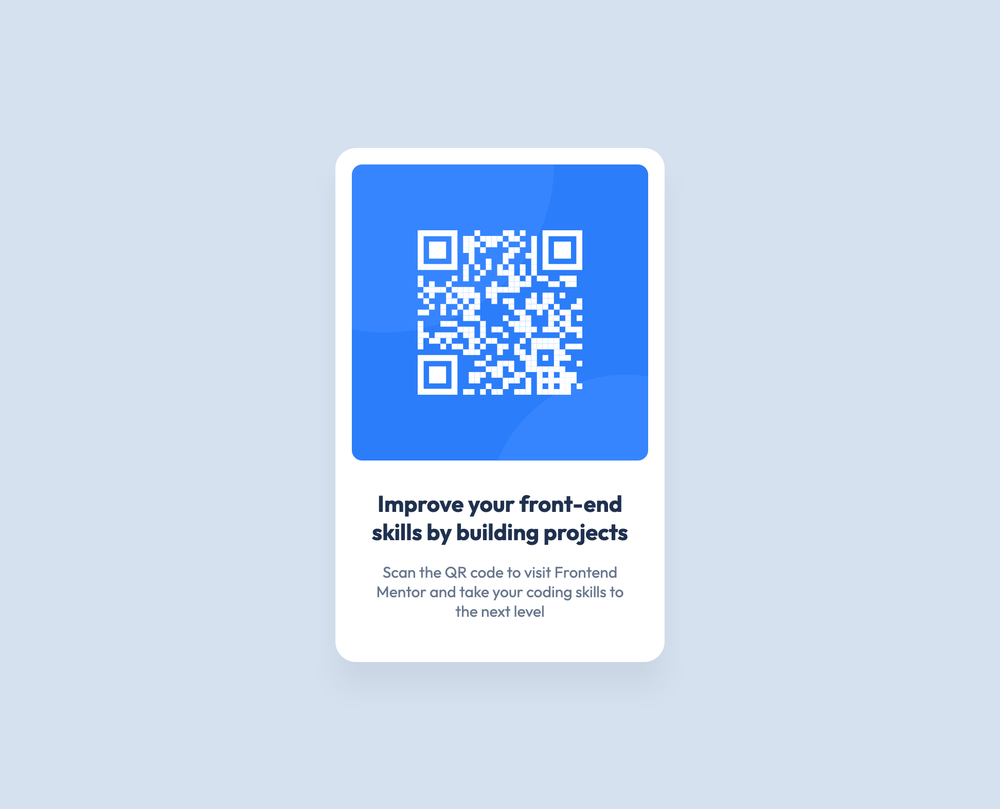

# Frontend Mentor - QR code component solution

This is a solution to the [QR code component challenge on Frontend Mentor](https://www.frontendmentor.io/challenges/qr-code-component-iux_sIO_H). Frontend Mentor challenges help you improve your coding skills by building realistic projects. 

## Table of contents

- [Overview](#overview)
  - [Screenshot](#screenshot)
  - [Links](#links)
- [My process](#my-process)
  - [Built with](#built-with)
  - [What I learned](#what-i-learned)
  - [Continued development](#continued-development)
  - [Useful resources](#useful-resources)
- [Author](#author)
- [Acknowledgments](#acknowledgments)

## Overview

### Screenshot




### Links

- Solution URL: [My solution is here](https://tomdoneix.github.io/qr-code-component/)

## My process

### Built with

- New CSS reset
- Mobile first
- Flexbox

### What I learned

Use this section to recap over some of your major learnings while working through this project. Writing these out and providing code samples of areas you want to highlight is a great way to reinforce your own knowledge.

```css
@import url(./new-css-reset.css);
```

```css
@font-face {
  font-family: Outfit;
  src: url(../font/Outfit-VariableFont_wght.ttf);
}
```


## Author

- Frontend Mentor - [@TomDoneix](https://www.frontendmentor.io/profile/TomDoneix)